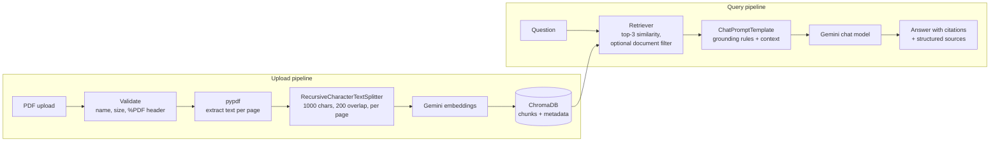

# DocMind – RAG-Powered Personal Knowledge Base

[](https://github.com/hetmmehta/DocMind/actions/workflows/ci.yml)
[](LICENSE)

Answers buried in a stack of PDFs (reports, resumes, notes) are slow to find with Ctrl+F, and pasting whole documents into a chatbot gives answers you can't verify. DocMind is a full-stack retrieval-augmented generation (RAG) app: you upload PDFs, it indexes them page by page in a vector database, and Gemini answers questions **using only the retrieved passages**, citing the file and page for every claim. If the answer isn't in your documents, it says so instead of guessing.

## Features

- **PDF ingestion**: page-by-page text extraction (pypdf), recursive chunking that never crosses page boundaries, Gemini embeddings (`gemini-embedding-001`), persisted in ChromaDB with `filename` / `page_number` / `chunk_index` metadata.
- **Grounded Q&A with citations**: a LangChain LCEL retrieval chain (retriever → prompt → `gemini-3.5-flash` → output parser) answers only from the top-k retrieved chunks, cites `(file.pdf, page N)`, and returns structured `sources` with text previews.
- **Document management**: list ingested documents with page/chunk counts, delete a document, re-upload to replace it cleanly (no stale chunks), and optionally scope a question to a single document.
- **Safe uploads**: sanitized filenames with a random prefix, `%PDF` header check, configurable size limit (20 MB default), and clean JSON errors, including a `429` when the Gemini quota is exhausted during upload or chat.
- **React + Vite frontend** for upload, document list, and chat with source cards; Flask REST API backend.
- **Tested**: pytest suite with Gemini fully mocked (no network, no API key) and GitHub Actions CI.

## Architecture



The query side is a single LCEL chain in `backend/services/rag_chain.py` (simplified):

```python
answer_chain = (
    RunnablePassthrough.assign(context=lambda x: format_docs(x["docs"]))
    | prompt
    | llm
    | StrOutputParser()
)
chain = RunnableParallel(docs=retriever, question=RunnablePassthrough()).assign(answer=answer_chain)
```

The retrieved documents stay in the chain output so the API can return them as `sources` next to the answer.

## Tech Stack

**Frontend:** React 18, Vite, CSS

**Backend:** Python, Flask, LangChain (LCEL), ChromaDB, Google Gemini API (`langchain-google-genai`), pypdf, pytest

## Project Structure

```text
DocMind/
├── backend/
│   ├── app.py                  # Flask app factory, CORS, blueprints
│   ├── config.py               # env-driven settings (paths, CORS, limits, debug)
│   ├── routes/
│   │   ├── upload_routes.py    # POST /upload
│   │   ├── chat_routes.py      # POST /chat
│   │   └── document_routes.py  # GET /documents, DELETE /documents/<name>
│   ├── services/
│   │   ├── document_loader.py  # pypdf text extraction per page
│   │   ├── chunking.py         # per-page recursive chunking
│   │   ├── vector_store.py     # Chroma: replace / list / delete documents
│   │   ├── rag_chain.py        # LCEL retrieval chain
│   │   ├── errors.py           # Gemini quota / rate-limit detection
│   │   └── storage.py          # stored upload cleanup
│   ├── tests/                  # pytest suite (Gemini mocked)
│   ├── requirements.txt
│   └── .env.example
├── frontend/
│   ├── src/App.jsx
│   ├── src/App.css
│   └── .env.example
├── .github/workflows/ci.yml
└── LICENSE
```

## Getting Started

### Prerequisites

- Python 3.9+ (CI runs 3.11)
- Node.js 20+
- A Google AI Studio API key for Gemini

### Backend

```bash
cd backend
python3 -m venv venv
source venv/bin/activate
pip install -r requirements.txt

cp .env.example .env
# then edit .env and set GOOGLE_API_KEY

python app.py
```

The API runs on `http://localhost:5001`.

| Variable | Default | Purpose |
| --- | --- | --- |
| `GOOGLE_API_KEY` | (required) | Gemini chat + embeddings |
| `FLASK_DEBUG` | `0` | Enable Flask debug mode (local development only) |
| `PORT` | `5001` | Port for `python app.py` |
| `CORS_ORIGINS` | `http://localhost:5173` | Comma-separated list of allowed frontend origins |
| `MAX_UPLOAD_MB` | `20` | Maximum upload size |
| `UPLOAD_FOLDER` | `backend/uploads` | Where uploaded PDFs are stored (relative paths resolve from `backend/`) |
| `CHROMA_DB_DIR` | `backend/chroma_db` | ChromaDB persistence directory |

### Frontend

```bash
cd frontend
npm install
cp .env.example .env   # optional: VITE_API_URL defaults to http://localhost:5001
npm run dev
```

The UI runs on `http://localhost:5173`.

## API

| Method | Endpoint | Body | Description |
| --- | --- | --- | --- |
| `GET` | `/` | | Health check |
| `POST` | `/upload` | `multipart/form-data` with `file` (PDF) | Extract, chunk, embed and store a PDF. Re-uploading the same filename replaces it. |
| `GET` | `/documents` | | List ingested documents: `filename`, `pages`, `chunks` |
| `DELETE` | `/documents/<filename>` | | Remove a document's chunks and stored file |
| `POST` | `/chat` | `{"question": "...", "document": "optional.pdf"}` | Answer from the top-k chunks; returns `answer` and `sources` |

Example `/chat` response:

```json
{
  "answer": "Het built DocMind, a RAG app for PDFs (Profile.pdf, page 2).",
  "sources": [
    {"filename": "Profile.pdf", "page_number": 2, "chunk_index": 0, "preview": "Het built DocMind..."}
  ]
}
```

Errors are always JSON `{"error": "..."}`: `400` invalid input or file, `413` file too large, `422` PDF has no extractable text (e.g. scanned), `429` Gemini quota exceeded, `500` unexpected error (details are logged server-side, never returned).

## Design Choices

- **Chunk size 1000 characters, overlap 200.** About two or three paragraphs: big enough to hold a complete answer, small enough that retrieval stays specific. The 20% overlap keeps a sentence that falls on a chunk boundary intact in at least one chunk.
- **Chunk per page, never across pages.** Each chunk maps to exactly one page, so every citation points to a real page number.
- **Top-k = 3.** Keeps the prompt short (about 3,000 characters of context), which keeps answers focused, citations precise and token usage low on the Gemini free tier. The trade-off: questions whose answer is spread across many sections can miss part of it.
- **Temperature 0.2 and an explicit refusal string.** The model is told to answer only from the context and otherwise reply "I could not find that information in the uploaded documents.", which makes unsupported answers easy to spot.
- **Replace on re-upload.** New chunks are written before the old ones are deleted, so a failed upload (e.g. quota error) never loses the existing copy.
- **Quota handling in one place.** `services/errors.py` checks Google exception types and HTTP 429 status codes (including errors wrapped by LangChain) before falling back to message matching, so upload and chat return the same `429`.

## Running Tests

```bash
cd backend
source venv/bin/activate
pytest
```

The tests never call Gemini or the network: the LLM, retriever and embeddings are replaced with fakes, and a temporary Chroma store is used. They cover chunking, upload validation (non-PDF, bad header, path traversal, oversize), quota errors on upload and chat, chat sources, and document replace/list/delete.

CI (`.github/workflows/ci.yml`) runs the backend tests on Python 3.11 and lints and builds the frontend on Node 20.

## Limitations

- Scanned (image-only) PDFs are rejected because there is no OCR step.
- One shared collection with no user accounts: everyone using an instance sees the same documents.

## License

[MIT](LICENSE) © 2026 Het Mehta
